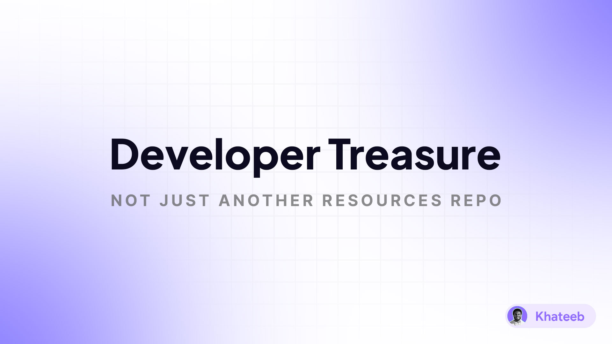

# Developer Treasure

- [Developer Treasure](#developer-treasure)
  - [Code Editors](#code-editors)
  - [VS Code Extensions](#vs-code-extensions)
  - [Icons](#icons)
  - [UI Libraries](#ui-libraries)
    - [React](#react)

## Code Editors

1. [Visual Studio Code](https://code.visualstudio.com/)
2. [Sublime Text](https://www.sublimetext.com/)
3. [Atom](https://atom.io/)
4. [Notepad++](https://notepad-plus-plus.org/)
5. [Coffee Cup](https://www.coffeecup.com/free-editor/)
6. [NetBeans](https://netbeans.apache.org/)
7. [TextMate](https://macromates.com/)
8. [Codeshare](https://codeshare.io/)
9. [Spacemacs](https://www.spacemacs.org/)
10. [CodePen](https://codepen.io/)
11. [Replit](https://replit.com/)
12. [JetBrains Fleet](https://www.jetbrains.com/fleet/)
13. [CodeSandbox](https://codesandbox.io/)
14. [Actipro CodeWriter](https://www.actiprosoftware.com/products/apps/codewriter)
15. [JSFiddle](https://jsfiddle.net/)
16. [Glitch](https://glitch.com/)
17. [StackBlitz](https://stackblitz.com/)
18. [Eclipse](https://www.eclipse.org/)

## VS Code Extensions

1. [CodeSnap](https://marketplace.visualstudio.com/items?itemName=adpyke.codesnap)
2. [VSCode Power Mode](https://marketplace.visualstudio.com/items?itemName=hoovercj.vscode-power-mode)
3. [Quicktype](https://marketplace.visualstudio.com/items?itemName=quicktype.quicktype)
4. [Quicktype](https://marketplace.visualstudio.com/items?itemName=quicktype.quicktype)
5. [Add Doc Comments](https://marketplace.visualstudio.com/items?itemName=stevencl.addDocComments)
6. [CSV to Table](https://marketplace.visualstudio.com/items?itemName=phplasma.csv-to-table)
7. [Peacock](https://marketplace.visualstudio.com/items?itemName=johnpapa.vscode-peacock)
8. [Multi Command](https://marketplace.visualstudio.com/items?itemName=ryuta46.multi-command)
9. [JSON Parse Stringify](https://marketplace.visualstudio.com/items?itemName=nextfaze.json-parse-stringify)
10. [Grammarly](https://marketplace.visualstudio.com/items?itemName=znck.grammarly)
11. [Prettier](https://marketplace.visualstudio.com/items?itemName=esbenp.prettier-vscode)
12. [Auto Rename Tag](https://marketplace.visualstudio.com/items?itemName=formulahendry.auto-rename-tag)
13. [TODO Highlight](https://marketplace.visualstudio.com/items?itemName=wayou.vscode-todo-highlight)
14. [Bookmarks](https://marketplace.visualstudio.com/items?itemName=alefragnani.Bookmarks)
15. [Better Comments](https://marketplace.visualstudio.com/items?itemName=aaron-bond.better-comments)
16. [Color Highlight](https://marketplace.visualstudio.com/items?itemName=naumovs.color-highlight)
17. [CSS Peek](https://marketplace.visualstudio.com/items?itemName=pranaygp.vscode-css-peek)
18. [ErrorLens](https://marketplace.visualstudio.com/items?itemName=usernamehw.errorlens)
19. [Live Pug Compiler](https://marketplace.visualstudio.com/items?itemName=jaheenafsarsyed.live-pug-compiler)
20. [Live Server](https://marketplace.visualstudio.com/items?itemName=ritwickdey.LiveServer)
21. [Markdown All in One](https://marketplace.visualstudio.com/items?itemName=yzhang.markdown-all-in-one)
22. [Material Theme](https://marketplace.visualstudio.com/items?itemName=zhuangtongfa.Material-theme)
23. [Quokka](https://marketplace.visualstudio.com/items?itemName=WallabyJs.quokka-vscode)
24. [VSCode Icons](https://marketplace.visualstudio.com/items?itemName=vscode-icons-team.vscode-icons)
25. [Color to HSL](https://marketplace.visualstudio.com/items?itemName=Alexander-Corp.colortohsl)
26. [Regex](https://marketplace.visualstudio.com/items?itemName=chrmarti.regex)
27. [Docker](https://marketplace.visualstudio.com/items?itemName=ms-azuretools.vscode-docker)
28. [Terraform](https://marketplace.visualstudio.com/items?itemName=HashiCorp.terraform)
29. [Live Sass Compiler](https://marketplace.visualstudio.com/items?itemName=glenn2223.live-sass)
30. [ESLint](https://marketplace.visualstudio.com/items?itemName=dbaeumer.vscode-eslint)
31. [Eno](https://marketplace.visualstudio.com/items?itemName=Wscats.eno)
32. [TypeScript Compiler](https://marketplace.visualstudio.com/items?itemName=MohammadMD.vscode-tsc)

## Icons

1. [Material Design Icons](https://materialdesignicons.com/)
2. [Icons8](https://icons8.com/)
3. [Font Awesome](https://fontawesome.com)
4. [The Noun Project](https://thenounproject.com/)
5. [Feather Icons](https://feathericons.com/)
6. [Remix Icon](https://remixicon.com/)
7. [Iconoir](https://iconoir.com/)
8. [Bootstrap Icons](https://icons.getbootstrap.com/)
9. [CSS.gg](https://css.gg/)
10. [Tabler Icons](https://tabler-icons.io/)
11. [Devicons](https://vorillaz.github.io/devicons/#/dafont)
12. [Ant Design Icons](https://ant.design/components/icon/)
13. [Boxicons](https://boxicons.com/)
14. [Game Icons](https://game-icons.net/)
15. [Octicons](https://primer.style/octicons/)
16. [Grommet Icons](https://icons.grommet.io/)
17. [Heroicons](https://heroicons.com/)
18. [Icomoon](https://icomoon.io/)
19. [Ionicons](https://ionic.io/ionicons)
20. [Simple Icons](https://simpleicons.org/)
21. [Typicons](https://www.s-ings.com/typicons/)
22. [Google Fonts Icons](https://fonts.google.com/icons)

## UI Libraries

### React

1. [Material UI](https://mui.com/)
2. [Chakra UI](https://chakra-ui.com/)
3. [Ant Design](https://ant.design/)
4. [React Bootstrap](https://react-bootstrap.github.io/)
5. [React Toolbox](https://react-toolbox.io/)
6. [React Spectrum](https://react-spectrum.adobe.com/)
7. [React Suite](https://rsuitejs.com/)
8. [React MDL](https://tleunen.github.io/react-mdl/)
9. [React Toolkit](https://react-toolkit.com/)
10. [React Semantic UI](https://react.semantic-ui.com/)
11. [Dot UI](https://dotui.org/)
